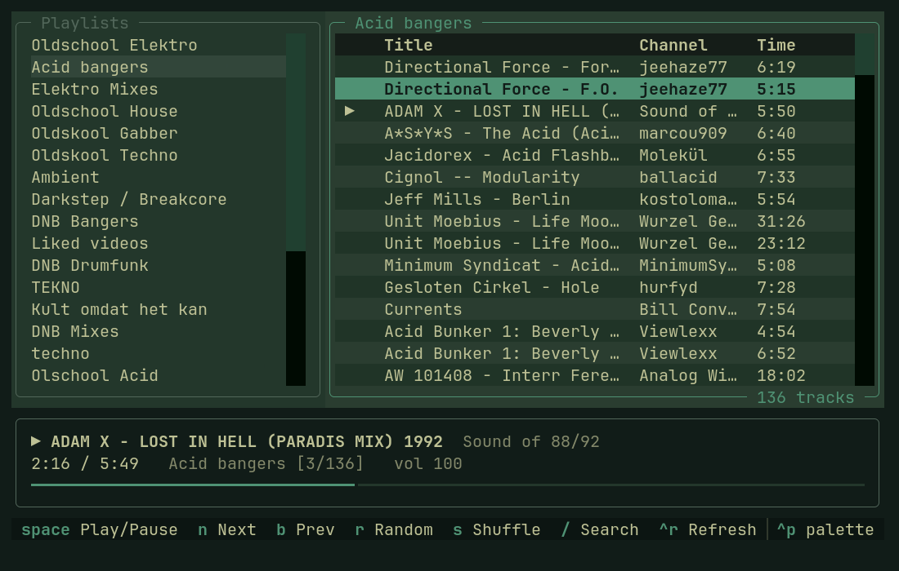

# yt-pplayer — YouTube Playlist Player



Terminal audio player for your YouTube playlists. Uses your Chromium login
(cookies read from the GNOME keyring), yt-dlp to list playlists and resolve
audio streams, and a headless mpv for playback — so no YouTube ads. Non-music
segments are skipped via SponsorBlock. mpv's MPRIS plugin makes media keys work.

## Run

    yt-pplayer          # or .venv/bin/yt-pplayer, or Super+M on Omarchy

Setup (also after a Python upgrade breaks the venv): `./setup.sh`

yt-dlp comes from pacman and is updated by `omarchy update`. The venv only
holds textual and secretstorage.

## Keys

| Key            | Action                              |
|----------------|-------------------------------------|
| enter          | open playlist / play track          |
| space          | play/pause                          |
| n / b          | next / previous                     |
| r              | jump to a random track              |
| s              | toggle shuffle                      |
| ← / →          | seek ±10s  (`,` / `.` = ±1 min)     |
| + / -          | volume                              |
| /              | filter tracks (esc to close)        |
| tab            | switch pane                         |
| ctrl+r         | refresh playlists                   |
| q              | quit                                |

## Config (env vars)

- `YT_PPLAYER_BROWSER` — default `chromium`
- `YT_PPLAYER_KEYRING` — default `GNOMEKEYRING`
- `YT_PPLAYER_THEME` — a built-in Textual theme (e.g. `nord`) instead of following
  the Omarchy theme

By default the colors come from the active Omarchy theme
(`~/.local/state/omarchy/current/theme/colors.toml`) and follow
`omarchy theme set` live.

Playlist data is cached in `~/.cache/yt-pplayer/`. If playback breaks after a
YouTube change, run `omarchy update`. If Arch hasn't packaged the fix yet,
`.venv/bin/pip install -U yt-dlp` overrides it until the next `./setup.sh`.

## Omarchy: Super+M to show/hide

`omarchy/yt-pplayer-toggle` starts the player on a hidden special workspace,
and on later presses shows or hides it — the music keeps playing while it's
hidden. Closing the window (Super+W) or pressing `q` stops it.

    ln -s "$PWD/omarchy/yt-pplayer-toggle" ~/.local/bin/
    ln -s "$PWD/.venv/bin/yt-pplayer" ~/.local/bin/

`~/.config/hypr/bindings.lua`:

```lua
o.bind("SUPER + M", "YouTube Playlist Player", "yt-pplayer-toggle")
```

`~/.config/hypr/hyprland.lua`:

```lua
o.window("org.omarchy.yt-pplayer", { float = true })
o.window("org.omarchy.yt-pplayer", { center = true })
o.window("org.omarchy.yt-pplayer", { size = { 1100, 700 } })
o.window("org.omarchy.yt-pplayer", { workspace = "special:music" })
```

## License

MIT — see [LICENSE](LICENSE).
